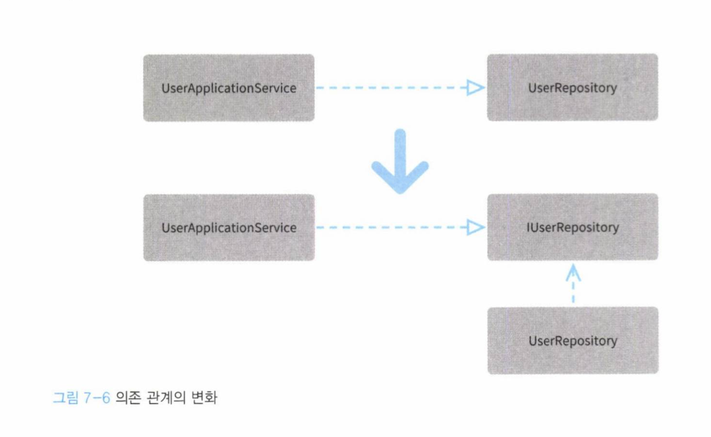

- [7.1 특정 기술 요소에 대한 의존의 결과](#71-특정-기술-요소에-대한-의존의-결과)
- [7.2  의존이란 무엇인가?](#72--의존이란-무엇인가)
- [7.3 의존 관계 역전 원칙이란?](#73-의존-관계-역전-원칙이란)
  - [7.3.1 추상 타입에 의존하라](#731-추상-타입에-의존하라)
  - [7.3.2 주도권을 추상 타입에 둬라](#732-주도권을-추상-타입에-둬라)
- [7.4 의존 관계 제어하기](#74-의존-관계-제어하기)
  - [7.4.1 Service Locator 패턴](#741-service-locator-패턴)
  - [7.4.2 IoC Container 패턴](#742-ioc-container-패턴)
- [7.5 정리](#75-정리)

### 7.1 특정 기술 요소에 대한 의존의 결과

복잡하게 여러 컴포넌트가 얽힌 상황을 설명하며 이러한 환경에서 코드를 수정하는 어려움에 대해서 설명한다.
여기서 특정 기술 요소라 함은 데이터베이스나 여러 라이브러리 구현들이 해당될 수 있다.
의존 관계 제어는 이러한 상황에서 도메인 로직에서 기술적 요소를 분리해 소프트웨어를 유연하게 만드는 방법을 설명한다.

### 7.2  의존이란 무엇인가?

의존 관계는 구체 클래스 간, 구체 클래스와 추상 타입가넹도 발생한다. 이는 자연스러운 현상이며 어떤 클래스가 추상 타입을 구현한다면 이러한 관계를 일반화 관계라고 한다.

구체 타입이 구체 타입을 의존하면 테스트가 어려워진다. 하지만 이러한 상황에서 추상 타입으로 의존의 방향을 바뀌면 테스트용 구상 타입을 의존하게 하여 해결할 수 있다.

추상타입을 이용해 의존 관계를 제어하는 것을 `의존 관계 역전 원칙`이라고 한다.


### 7.3 의존 관계 역전 원칙이란?

프로그램에는 추상화 수준이라는 개념이 있는데, 추상화 수준은 입 - 출력으로부터의 거리를 뜻한다. 추상화 수준이 낮다는 것은 기계와 가까운 구체적인 처리를 말하며 추상화 수준이 높다는 것은 가람과 가까운 추상적인 처리를 의미한다.

#### 7.3.1 추상 타입에 의존하라

- 추상화 수준이 높은 모듈 : 사람에 가까운 모듈
- 추상화 수준이 낮은 모듈 : 기술적 세부 사항(데이터베이스, 캐시 등)에 가까운 모듈

추상화 수준이 높은 모듈이 낮은 모듈에 직접 의존하게 되면 의존 관계가 낮은 모듈로 향하게 되는데 이를 추상 타입(인터페이스)로 바꾸면, 추상화 수준이 높은 모듈이 필요한 내용을 인터페이스에 기록하고 이를 추상화 수준이 낮은 모듈이 구현하게 되니까 의존 관계가 역전되게 된다. 구체적인 내용에 대해서 의존하는 것이 아닌 추상화 수준이 높은 모듈의 원하는 데로 인터페이스를 정의하면 낮은 모듈이 높은 모듈의 인터페이스를 맞춰가야하므로 의존관계가 일반적인 경우에 다르게 역전된다는 것.




#### 7.3.2 주도권을 추상 타입에 둬라

- 전통적으로는 추상화 수준이 높은 모듈이 낮은 모듈에 의존하고 있는 형태로 개발됨 → 이는 추상타입이 세부사항에 의존한다는 말로도 이해할 수 있음.
- 도메인 규칙은 항상 추상화 수준이 높은 곳에 기술되고, 낮은 수준의 모듈의 변경 떄문에 높은 수준의 모듈이 변경되는 것은 바람직하지 않음
- 항상 추상타입이 높은 쪽이 변경의 주체가 되어야 함.


### 7.4 의존 관계 제어하기

#### 7.4.1 Service Locator 패턴

- Service locator 객체에 의존 해소 대상이 되는 객체를 미리 등록해둔 다음 인스턴스가 필요한 곳에서 locator를 통해 받아오는 형태

```csharp
public class UserApplicationService
{
	private readonly IUserRepository userRepository;
	public UserApplicationService() {
		this.userRepository = ServiceLocator.Resolve<IUserRepository>();
	}
}
```

Service Locator 패턴이 안티패턴으로 보는 이유

- 의존 관계를 외부에서 보기 어려움 : 클래스의 생성자 시그니처만 보고 이 클래스를 사용하기가 쉽지 않음.
- 테스트 유지가 어렵다 : 의존이 변경되었을 때 테스트 코드도 항상 함께 변경해야하는데, 이러한 경우 컴파일러가 알려주지 않으므로 놓치기 쉬움.

#### 7.4.2 IoC Container 패턴
    
> DI Pattern : 생성자를 사용하여 의존 관계를 사용자 측에서 주입한다고 해서 Dependency Injection이라고 부름
> 

생성자의 시그니처가 변경되면 컴파일러가 테스트코드를 컴파일 할 때 변경된 내용에 따라 컴파일에 실패하게 됨.

하지만 객체를 생성하는 코드를 여기저기에 작성해야하므로 시그니처가 변경되었을 때 사용하는 모든 곳에서 객체를 생성해야함.

IoC(Inversion of Control)패턴은 객체 생성의 컨트롤을 개발자가 아닌 프로그램이 한다고 해서 IoC라고 하며 IoC컨테이너에 적절히 등록하고 생성된 객체를 받아오는 패턴.

```csharp
var serviceCollection = new ServiceCollection();
serviceCollection.Add<IUserRepository, InMemoryRepository>();
...
var provider = serviceCollection.BuildServiceProvier();
var service = provider.GetService<UserApplicationService>();
```

### 7.5 정리

> 사용자가 처한 환경의 변화에 맞춰 변화하며 지속적으로 사 용자에게 도움을 줄 수 있어야 한다. 그렇기 때문에 ‘소프트’웨어인 것이다. - 165P